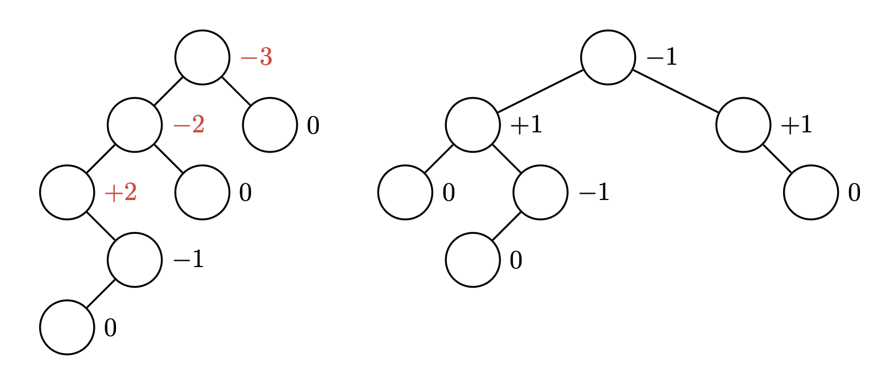

# Kapitel 2: Bäume

---

### Aufgabe 2.1

**Aufgabe:** Bestimmen Sie den Typ aller Knoten in folgender Abbildung. Beachten Sie, dass einzelne Knoten auch mehrere Typen sein können.

**Antwort:**

- **Wurzel**: Die Wurzelknoten sind a und b.
- **Blätter**: Die Blätter (Knoten ohne Kinder) sind a, e, f, g und h.
- **Innere Knoten**: Knoten b, c und d, da sie mindestens ein Kind besitzen.

---

### Aufgabe 2.2

**Aufgabe:** Bestimmen Sie für die zwei Bäume der Aufgabe 2.1:
a) die Höhe,  
b) die Ordnung,  
c) die Niveaus,  
d) ob der Baum ausgefüllt ist,  
e) den Grad aller Knoten  
f) und die Tiefe jedes Knotens.

**Antwort (kompakt):**

- **a) Höhe**:
  - Linker Baum: Höhe = 1
  - Rechter Baum: Höhe = 3
- **b) Ordnung**:
  - Linker Baum: beliebig (nur ein Knoten), kann jede Ordnung ≥1 haben.
  - Rechter Baum: mindestens Ordnung 3, da ein Knoten Grad 3 hat.
- **c) Niveaus**:
  - Linker Baum: Nur Niveau 1 (nur Wurzel).
  - Rechter Baum: Niveau 1: Wurzel; Niveau 2: deren Kinder; Niveau 3: deren Kinder usw. (Details siehe Tabelle in Originallösung).
- **d) Ausgefüllt**:
  - Linker Baum: Ausgefüllt (kein innerer Knoten mit „fehlenden“ Kindern).
  - Rechter Baum: Nicht ausgefüllt (ein innerer Knoten hat weniger als die maximale Kinderzahl).
- **e) Grad aller Knoten**:
  - Linker Baum: Grad(Wurzel) = 0.
  - Rechter Baum: Grad laut Tabelle: z.B. Knoten a Grad 4, b Grad 1, c Grad 3, d Grad 2, e,f,g,h Grad 0, i Grad 2, j Grad 0, k Grad 1, l Grad 0, m Grad 1, n,o Grad 0.
- **f) Tiefe jedes Knotens**:
  - Linker Baum: Tiefe(Wurzel) = 1.
  - Rechter Baum: Tiefe gemäß Ebene: Wurzel Tiefe 1, deren Kinder Tiefe 2, deren Kinder Tiefe 3 usw. (s. Tabelle).

---

### Aufgabe 2.3

**Aufgabe:** Bestimmen Sie im folgenden Baum die Typen der Knoten. Füllen Sie dazu die vorgegebene Tabelle aus.

a

/ |
b c d e
/ \ (etc.; vgl. Abbildung)
f g h
i j k
l m n
o

_(Struktur gemäß Aufgabenstellung der Abbildung)_

**Antwort (kompakt):**

- **Wurzel**: a
- **Blätter**: a, b, c, d, e, f, g, h, i, j, k, l, m, n, o — je nach exakter Baumstruktur, aber insbesondere die Knoten ohne Kinder.
- **Innere Knoten**: a (auch Wurzel), plus alle Knoten mit mindestens einem Kind (z. B. b, c, d etc. laut Abbildung).

---

### Aufgabe 2.4

**Aufgabe:** Bestimmen Sie für jeden Knoten des Baumes der Aufgabe 2.3 die Tiefe und den Grad.

**Antwort:**

- **Tabelle (Beispiel für die in der Abbildung verwendeten Bezeichnungen):**
  - a: Grad = 4, Tiefe = 1
  - b: Grad = 1, Tiefe = 2
  - c: Grad = 3, Tiefe = 2
  - d: Grad = 2, Tiefe = 2
  - e: Grad = 0, Tiefe = 3
  - f: Grad = 0, Tiefe = 3
  - g: Grad = 0, Tiefe = 3
  - h: Grad = 0, Tiefe = 3
  - i: Grad = 2, Tiefe = 3
  - j: Grad = 0, Tiefe = 3
  - k: Grad = 1, Tiefe = 3
  - l: Grad = 0, Tiefe = 4
  - m: Grad = 1, Tiefe = 4
  - n: Grad = 0, Tiefe = 4
  - o: Grad = 0, Tiefe = 5

---

### Aufgabe 2.5

**Aufgabe:** Zeichnen Sie im Baum der Aufgabe 2.3 die Niveaus und die Höhe ein. Überlegen Sie sich, welche Ordnung dieser Baum haben könnte, und begründen Sie Ihre Entscheidung.

**Antwort (kompakt):**

- **Höhe**: 5 (Tiefster Knoten o hat Tiefe 5).
- **Niveaus**: Ebene 1: a; Ebene 2: b, c, d; Ebene 3: Kinder von b/c/d; Ebene 4: etc.; Ebene 5: o.
- **Ordnung**: Da der höchste Grad 4 (bei Knoten a) auftritt, ist Ordnung ≥4; also z. B. Ordnung 4. [oai_citation:5‡Leitprogramm_Bäume.pdf](file-service://file-SjEaRRbCGMKr2pgepoksq2)

---

### Aufgabe 2.6

**Aufgabe:** Gegeben sind drei folgende Bäume der Ordnung 2. Entscheiden Sie, welche Bäume vollständig und welche ausgefüllt sind, und begründen Sie Ihre Antwort.

_(Die drei Bäume sind in der Original-Abbildung, z. B. ein einzelner Knoten, ein Baum mit Lücken, etc.)_

**Antwort:**

- **Baum 1 (nur Wurzel)**:
  - Keine inneren Knoten → ausgefüllt.
  - Auf Niveau 1 ist maximale Knotenzahl erreicht (1). → vollständig.
- **Baum 2 (ebenfalls nur Wurzel)**:
  - Ausgefüllt (kein innerer Knoten hat fehlende Kinder).
  - Nicht vollständig, falls auf einem tieferen Niveau weniger Knoten als max. möglich (z. B. Niveau 3 nur 2 statt 4 Knoten).
- **Baum 3**:
  - Nicht ausgefüllt, da ein innerer Knoten weniger als 2 Kinder hat.
  - Folglich auch nicht vollständig.

---

### Aufgabe 2.7

**Aufgabe:** Recherchieren Sie drei spezielle Bäume und deren wichtigste Anwendung. Beachten Sie dabei besondere Eigenschaften wie Ordnung, etc.

**Antwort:**

1. **B-Baum**:
   - Ordnung >2 (m-äre Struktur), Mehrfachverzweigung pro Knoten.
   - Anwendung: Datenbank-/Dateisystem-Indizes (minimiert Festplattenzugriffe durch breite Fan-out).
2. **Heap (Binärer Heap)**:
   - Binärer Baum (Ordnung 2), nahezu vollständig (Komplettbaum), meist als Array repräsentiert.
   - Anwendung: Prioritätswarteschlange, Heapsort.
3. **Trie (Präfixbaum)**:
   - Mehrzweigiger Baum (Ordnung entspricht Alphabetgröße), Speicherung von Zeichenketten.
   - Anwendung: Autovervollständigung, Wörterbuchsuche, IP-Routing-Tabellen.

- Hinweise: Bei Auswahl darauf achten, dass die Struktur für die Anwendung optimal ist (z. B. Balancierung, Fan-out, Speicherlayout).

> **Hinweis:** Da in der Musterlösung keine konkrete Lösung angegeben ist, sind die obigen Beispiele typische Ergebnisse einer Recherche und können je nach Quelle variieren.

---

#### Beispiel für Tabelle in Aufgabe 2.4 (Markdown):

| Knoten | Grad | Tiefe |
| ------ | ---- | ----- |
| a      | 4    | 1     |
| b      | 1    | 2     |
| c      | 3    | 2     |
| d      | 2    | 2     |
| e      | 0    | 3     |
| f      | 0    | 3     |
| g      | 0    | 3     |
| h      | 0    | 3     |
| i      | 2    | 3     |
| j      | 0    | 3     |
| k      | 1    | 3     |
| l      | 0    | 4     |
| m      | 1    | 4     |
| n      | 0    | 4     |
| o      | 0    | 5     |

---

24.06.2025

Die Durchlaufordnung nach der Preorder-Reihenfolge ist:
a, b, d, e, g, c, f, h, j, i.

Die Durchlaufordnung nach der Postorder-Reihenfolge ist:
d, g, e, b, j, h, i, f, c, a.

Die Durchlaufordnung nach der Inorder-Reihenfolge ist:
d, b, g, e, a, c, h, j, f, i.

---

11.9.2025

## Kapitel 5: AVL Bäume

Aufgabe 5.1:
Der linke Baum ist kein AVL-Baum. Der rechte Baum ist ein AVL-Baum.

 