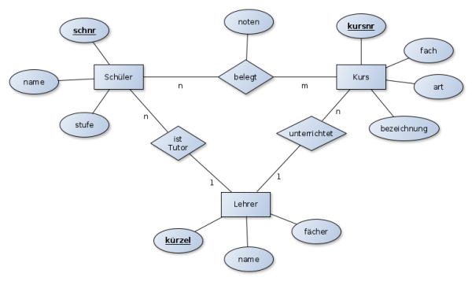

# Klausur Nr. 1 (Q2) Informatik-Leistungskurs   Datenbanksysteme (Beispiel/Übungsklausur)

PUNKTE: ( /100)  

ZEIT: 135 MINUTEN  
Datum: 07.03.2024  

NAME:

---

## Aufgabe 1:

Nennen Sie drei Vorteile eines Datenbanksystems.  
( /3 P)

---

## Aufgabe 2:

Gegeben ist folgendes ER-Modell:



Quelle: <https://www.herrmix.de/dokuwiki/doku.php?id=datenbanken:relational:er>

a) Erläutern Sie die Begriffe Entität, Attribut und Beziehung anhand des ER-Modells.  
b) Erstellen sie anhand des ER-Modells das relationale Datenbankmodell in der Form:  
   Tabellenname (Primärschlüssel, Attribute, ...)  
c) Erläutern Sie Ihre Vorgehensweise in b), indem Sie die Regeln beschreiben, die Sie für die  
   Umstellung angewendet haben.  
d) Nehmen Sie begründet Stellung zur Wahl des Primärschlüssels für die Tabelle Lehrer.  

( /4+6+5+1 P)

---

## Aufgabe 3:

Gegeben sind folgende Tabellen:

### LehrkraftGGL

| PersID | Name   | Vorname | Funktion     | Unterrichtsstunden |
|------:|--------|---------|--------------|--------------------|
| 1     | Müller | Klaus   | Beamter      | 26                 |
| 2     | Sieper | Nora    | Angestellter | 24                 |

### Fach

| FachID | Stufe | Fachname     |
|------:|------:|--------------|
| 1     | 10    | Mathematik   |
| 2     | 7     | Informatik   |

### unterrichtet

↑ PersID | ↑ FachID  
1        | 2  
2        | 1  

Formulieren Sie die folgenden Abfragen in SQL:

a) Wie viele Lehrkräfte sind in der Schule beschäftigt?  
( /2P)

b) Welche Lehrkräfte sind verbeamtet (Spalte Funktion)?  
   Gefragt sind PersID und Name.  
( /3P)

c) Welche PersID hat die Lehrkraft mit den Namen Müller?  
   Gefragt sind PersID und Vorname.  
   Der Spaltenname für die PersID soll LehrkraftID lauten.  
( /3P)

d) Welche Lehrkräfte unterrichten zwischen 20 und 26 Stunden pro Woche?  
   Gefragt sind Name und Unterrichtsstunden.  
( /3P)

e) Welche Lehrkräfte haben einen Namen, der mit R endet?  
   Gefragt sind PersID und Name.  
( /3P)

f) Welche Lehrkräfte haben einen Namen, der mit H oder mit I beginnt?  
   Gefragt sind Name und Vorname.  
( /4P)

g) Geben Sie eine Liste der Lehrkräfte, die ein Fach mit der FachID 2 unterrichten.  
   Die Liste soll nach Namen sortiert sein.  
   Gefragt sind Name und Vorname.  
( /5P)

h) Wie hoch ist die durchschnittliche Unterrichtszeit (in Stunden) der Lehrkräfte?  
( /3P)

i) Was ist die höchste Stufe in den einzelnen Fächern?  
   Gefragt sind je der Fachname und die höchste Stufe.  
( /5P)

j) In der Senatsdatenbank sind in der Tabelle LehrkraftGGL die Lehrkräfte des Goethe-Gymnasiums  
   und in der gleich strukturierten Tabelle LehrkraftLILI die Lehrkräfte des Lilienthal-Gymnasiums  
   vorhanden. Es sollen in einer Ergebnistabelle PersID und Lehrkraft-Name der beiden  
   Gymnasien zusammen ausgegeben werden.  

   Hinweis: Die PersID ist über beide Tabellen eindeutig.  
( /3P)

---

## Aufgabe 4:

a) Beschreiben Sie die Normalisierungsregeln für die 1. NF, 2. NF und die 3. NF!  
( /8 P)

b) Folgende Tabelle ist gegeben:

| Vater  | Mutter | Kinder        |
|--------|--------|---------------|
| Johann | Martha | Else, Lucia   |
| Johann | Maria  | Theo, Josef   |
| Heinz  | Martha | Cleo          |

Überführen Sie die Tabelle in die erste Normalform!  
( /2 P)

c) Erläutern Sie Ihr Vorgehen!  
( /2 P)

---

## Aufgabe 5:

Folgende Tabellen sind gegeben:

Kunde (KundenNr, KundenName, KundenVorname, KundenGebDatum)  
Video (VideoNr, VideoArt, VideoRegisseur)  
Ausleihe (↑VideoNr, ↑KundenNr, AusleiheDatum, KundenName, VideoArt, RückgabeDatum)

a) Überführen Sie die Tabellen in die zweite Normalform.  
( /2 P)

b) Erläutern Sie Ihr Vorgehen.  
( /3 P)

---

## Aufgabe 6:

Folgende Tabellen mit Beispielsätzen sind gegeben:

### Buch:

| ISBN               | Titel          | Autor        | Preis | VID |
|--------------------|----------------|--------------|-------|-----|
| 978-3-596-29433-6  | Der Zauberberg | Thomas Mann  | 12,95 | 596 |

### Verlag:

| VID | Name               | Ort           |
|----:|--------------------|---------------|
| 596 | Fischer Taschenbuch| Frankfurt a.M.|

Folgende SQL-Anweisung soll mithilfe relationaler Algebra optimiert werden.

```sql
SELECT Name FROM Buch, Verlag
WHERE Autor='Thomas Mann' AND Buch.VID=Verlag.VID;
```

a) Transformieren Sie die obige Anweisung in einen Ausdruck relationaler Algebra.

b) Erläutern Sie den Begriff des Kreuzprodukts und geben Sie die Anzahl von Schritten zur
Berechnung des Ausdrucks an, die sich bei einer Anzahl von 1000 Datensätzen in der Tabelle
Buch und 5 Datensätzen in der Tabelle Verlag ergeben.

c) Optimieren Sie den Ausdruck aus a) und geben Sie die damit notwendige Anzahl von Schritten
zur Berechnung des Ausdrucks an (unter der Annahme, dass es zwei Verlage gibt, die Bücher von
Thomas Mann veröffentlicht haben und insgesamt 6 Bücher von Thomas Mann veröffentlicht
wurden.).

d) Erläutern Sie Ihr Vorgehen bei der Optimierung.

( /15 P)

⸻

Aufgabe 7: JDBC

a) Erläutern Sie was JDBC ist und nennen Sie dabei auch die wichtigsten Funktionen von JDBC.

Erstellen Sie in einer Java-main-Methode folgende Funktionalitäten:

b) Verbinden Sie sich (embedded mode) mit einer derby-Datenbank, die sich im folgenden
Verzeichnis befindet:
C:\datenbanken\derby

c) Erzeugen Sie eine Tabelle Mitarbeiter, die folgende Spalten (Attribute) beinhaltet:
ID, Vorname, Nachname.

d) Fügen Sie in diese Tabelle zwei Zeilen mit von Ihnen selbst gewählten Werten ein.

e) Geben Sie die in der Tabelle vorhandenen Werte in einer lesbaren Form aus.

Hinweis: Die Methode main soll alle SQL-Ausnahmen (Exceptions) werfen.

( /15 P)

Hilfestellung:
Main-Methode:

public static void main(String[] args) { Anweisungen }

Viel Erfolg!
BITTE WENDEN!

⸻

Anlage

Java-Dokumentation

Ausgewählte Methode der Klasse DriverManager:

static Connection getConnection(String url)

Attempts to establish a connection to the given database URL.

Ausgewählte Methode der Klasse Connection:

Statement createStatement()

Creates a Statement object for sending SQL statements to the database.

Ausgewählte Methoden der Klasse Statement:

ResultSet executeQuery(String sql)

Executes the given SQL statement, which returns a single ResultSet object.

int executeUpdate(String sql)

Executes the given SQL statement, which may be an INSERT, UPDATE, or DELETE statement
or an SQL statement that returns nothing, such as an SQL DDL statement.

Ausgewählte Methoden der Klasse ResultSet:

boolean next()

Moves the cursor forward one row from its current position.

int getInt(String columnLabel)

Retrieves the value of the designated column in the current row of this ResultSet
object as an int in the Java programming language.

String getString(String columnLabel)

Retrieves the value of the designated column in the current row of this ResultSet
object as a String in the Java programming language.
